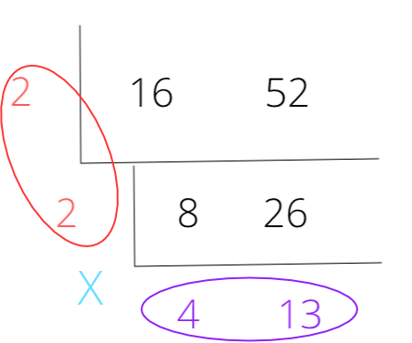

class: inverse, middle, center

# 最大公约数和最小公倍数

---
# 最大公约数

为什么需要用到最大公约数？

约分：

$$\frac{16}{52}, \frac{14}{98}, \frac{18}{66}$$

--
- 16 和 52 的最大公约数是 4

- 14 和 98 的最大公约数是 14

- 18 和 66 的最大公约数是 6

分子分母同时除以最大公约数，结果就是约分后的结果。

---
# 为什么是「最大」公约数？

因为我们想要最简化的结果。

比如，16 和 52 的公约数有 2 个： 2 和 4。除以 2 得到的结果是$$\frac{8}{26}$$

这不是最简单的，因为还可以再除以2。所以，只有除以 4， 也就是「最大」的公约数，才能约分到最简。

--

同样地，14 和 98 的公约数有 3 个：2， 7 和 14。除以 2 和 除以 7 都不能得到最简结果，所以要除以 14，也就是「最大」的公约数。

再比如，18 和 66 的公约数有 3 个：2， 3， 6。不管是除以 2，还是除以 3，都不能得到最简单的结果，所以要上下同时除以 6，也就是所有公约数当中「最大」的那个。

---
# 最小公倍数

什么时候需要用到最小公倍数？

通分的时候。比如，请计算：

$$\frac{3}{16} + \frac{5}{52}, \frac{5}{14} + \frac{7}{98}, \frac{3}{18} + \frac{7}{66}$$

--
16 和 52 的最小公倍数是 208， 14 和 98 的最小公倍数 98， 18 和 66 的最小公倍数是 198.

---
# 为什么是「最小」公倍数

- 16 和 52 的公倍数，不只有 208， 还有 $208 \times 2$, $208 \times 3$, $208 \times 4$ 

--

- 14 和 98 的公倍数，不只有 98， 还有 $98 \times 2$, $98 \times 3$, $98 \times 4$ 

--

- 18 和 54 的公倍数，不只有 198， 还有 $198 \times 2$, $198 \times 3$, $198 \times 4$ 

--

但是，如果我们可以直接用：

$$\frac{3}{16} + \frac{5}{52} = \frac{13}{208} + \frac{4}{208} = \frac{17}{208}$$

那就没有必要用

$$\frac{3}{16} + \frac{5}{52} = \frac{13\times 2}{208\times 2} + \frac{4 \times 2}{208 \times 2} = \frac{17 \times 2}{208 \times 2} = \frac{17}{208}$$
---
# 如何算出最大公约数和最小公倍数

.pull-left[]

.pull-right[

最大公约数 $2 \times 2 = 4$

最小公倍数 $2 \times 2 \times 4 \times 13 = 104$]

---
# 练习

用同样的方式，画出 14 和 98， 以及 18 和 54 的最大公约数、最小公倍数

.pull-left[]

.pull-right[]

---
# 分数加、减分数

分母替换为最小公倍数，然后加减

$$\frac{3}{18} + \frac{5}{54} = \frac{3 \times 3}{18} + \frac{5}{54} = \frac{9 + 5}{54} = \frac{14}{54} = \frac{7}{27}$$
你来算：

$$\frac{5}{14} - \frac{3}{98} = ?$$
$$\frac{5}{18} + \frac{53}{66} = ?$$
---
# 分数加减整数

$$3 + \frac{3}{2}$$
